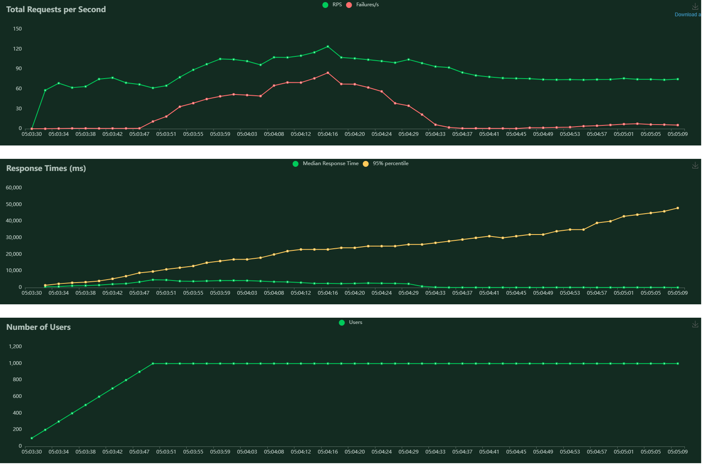

To first test my program I start with unit tests using the unittest library in Python. I went through each of the requirements and identified their respectives units in the project, and then created tests to ensure each one was working as intended. Where necessary I tested each unit with a variety of test cases, attempting bad requests and edge cases to make sure they were being handled properly.

I began the testing process for my program by conducting unit tests with the help of the unittest library. To figure out what to test I looked back at the requirements and test plan and then isolated the required units from the project. I then wrote tests to verify that each unit functioned as it should. To ensure thorough testing, I ran a range of test cases on each unit, including difficult scenarios and edge cases in order to confirm that they were being handled correctly.

This testing can be seen in the test_user_functions and test_admin_functions methods inside test_main.py

While writing and running the unit tests I found the following issues and fixed them:

Test Result: Failure when updating name, email, and address
Issue: The functions to change the email and address of the user were attempting to find the database record with the old name, but were unable because the name was being updated first.
Fix: Changed the code to update the local name variable after updating the name in the database.

Test Result: Failure when editing an order
Issue: The code wasn't catching when an order didn't exist
Fix: Changed the code to return a 400 error when the user tries to edit a non-existing order

Test Result: Failure when logging out without logging in
Issue: There was no message for the user when trying to logout without being logged in
Fix: Added a message to let the user know they can't log out because they're not logged in

Test Result: Failure when logging in with POST request while already logged in
Issue: The login page was expecting all POST requests to come from logged-out users, but this wasn't the case
Fix: Changed the login page to redirect the user if they're already logged in, even on a POST request

Test Result: Failure when searching for user information by ID
Issue: There was no way to know if a user with that ID didn't exist.
Fix: Added a message to let the admin know if there are no users with that ID

I additionally performed unit testing on the database used by the program, ensuring that the models were set up correctly and the methods were working as expected. These tests can be seen in the test_database method inside test_main.py.

After fixing these issues all of my test cases passed, giving a test yield of 100%. This is good but could also indicate that I missed some edge cases which could be important. 

To ensure that I was not missing any large parts of my code I used the coverage tool to calculate the test coverage of my tests as a percentage of the total code used by my tests. The tool returned a test coverage of 88% for main.py, indicating that my test cases covered the vast majority of code.

From there I moved on to integration testing, making sure that the Flask server, SQLAlchemy database and the rest of the code were all integrated properly and working as expected. To do this I performed similar tests to my previous unit testing but made sure to check the html output, session variables and database values at each step to ensure that all the components were integrated properly.

My integration testing all passed with a test yield of 100%, and the test coverage remained at 88% since I wasn’t testing any individual pieces of code that had not been run during the unit testing.

Since I had verified that the program functioned as expected through my unit and integration testing I focussed my system testing on the UI and did some performance testing. 

To test the UI I performed some manual tests attempting tasks as I would expect users to perform them, while keeping an eye on the log to ensure that all of the requests were sent through properly. I didn’t notice any discrepancy during these tests.

To test the performance of the system I decided to use locust, an open-source load testing tool which can be used to generate large amounts of traffic. To use this I create some simple tasks including visiting pages and working with orders which can be seen in locustfile.py. When running locust you can choose the amount of users to simulate and ramp it up at different rates, I tested with up to 1000 users since that number was enough to max out my computer’s CPU and start causing significant failure rates.

The graphs generated by locust can be seen below:

While under roughly 900 users the failure rate remained low but once my computer hit its limit the rate spiked quickly to over 50%. As time went on this began to smooth back out again but the worst-case response times continued to climb.

In summary, I thoroughly tested each unit in the program by verifying it was working as intended, including using a variety of test cases to handle uncommon scenarios. Through this process, I discovered and fixed several issues, such as problems with updating user information, editing orders, and logging in and out.

I also conducted integration testing to guarantee that all components of my program were working together efficiently. I checked HTML output, session variables, and database values at each step, resulting in a 100% test yield and a coverage rate of 88%.

In addition, I performed manual UI testing and performance testing using Locust. During manual UI testing, I observed no discrepancies, and during performance testing, the system was able to handle up to 900 users with low failure rates. However, when the number of users exceeded this amount, the failure rate spiked, and the worst-case response times increased, indicating room for improvement in the system's performance under heavy load.

Overall, I believe that I have demonstrated a comprehensive and thorough approach to testing my program and effectively found and fixed several issues in the process. The test results are generally positive, though there is room for improvement in some areas.
